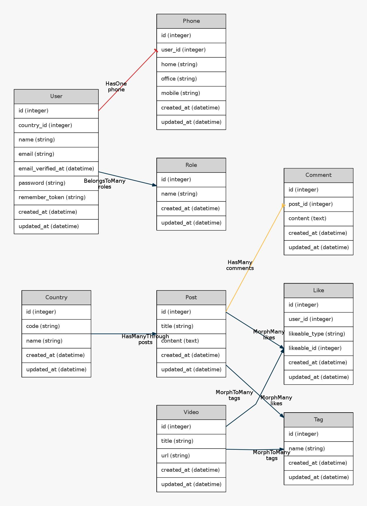
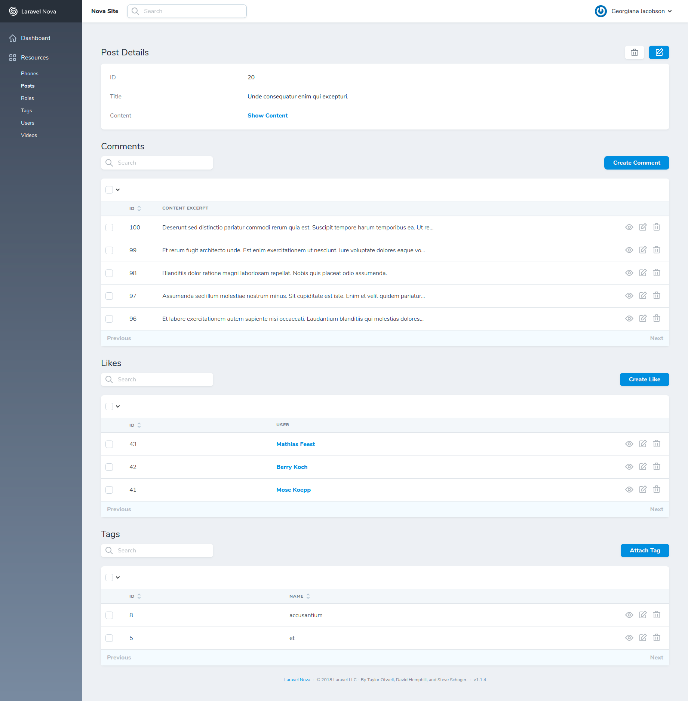

## Laravel Relationships Data

This repo contains the migrations, seeders and factories to get up and running with various relationships types data quickly. Laravel provides support for many types relationships out-of-the-box. And when there is a need to play with any one of them to test something, I hate repeating the same stuff of creating migration and seeding the data before I can write code to actually test something.

Here's how relationships are put here:

|     Relationship Type    |   Model 1  |  Model 2 |
|:------------------------:|:----------:|:--------:|
|        One to One        |    User    |   Post   |
|        One to Many       |    Post    | Comments |
|       Many to Many       |    User    |   Role   |
|     Has Many Through     |   Country  |   Phone  |
|        Polymorphic       | Post/Video |   Like   |
| Many to Many Polymorphic | Post/Video |    Tag   |

And here is the ER Diagram image generated with [this lovely package](https://github.com/beyondcode/laravel-er-diagram-generator/) by [Marcel Pociot](https://twitter.com/marcelpociot).



## Laravel Nova Scaffolder

This repo also contains the necessary resource classes for each of the models to manage all the entities from the powerful Laravel Nova admin panel. Following are the steps to get you there in a few minutes:

1) Clone the repo:
```
git clone https://github.com/freshbitsweb/laravel-relationships-data.git [DIRECTORY_NAME]
```

2) Create `.env` file from the example file:
```
composer run-script post-root-package-install
```

3) Setup .env variables (Mainly the Database details and App URL)

4) Install the dependencies and run migrations + seeders
```
composer install
composer run-script post-create-project-cmd
php artisan migrate --seed
```

5) Install [Laravel Nova](https://nova.laravel.com/docs/1.0/installation.html#installing-nova)

6) Head over to [APP_URL]/nova. You will see something like this on the post details page for example.

